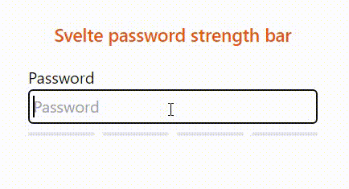

# Svelte-password-strength-bar
A simple **Svelte** component to show password strength bar



## Install
```
$ npm install svelte-password-strength-bar
```

## Usage
```
<script>
import PasswordStrength from "$lib/PasswordStrength.svelte";
let password = ""
</script>

<div class="w-72 mx-auto my-8">
    <div class="">
        <h1 class="text-center font-semibold text-lg mb-4 text-orange-600">Svelte password strength bar</h1>
        <label for="password" class="block">Password</label>
        <input 
            class="w-full p-1 border border-gray-600 rounded"
            type="password" 
            placeholder="Password" 
            name="password"
            bind:value={password}
        />
    </div>
    <PasswordStrength {password}/>
</div>
```